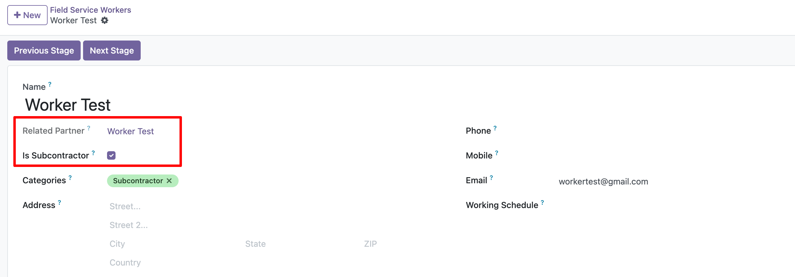
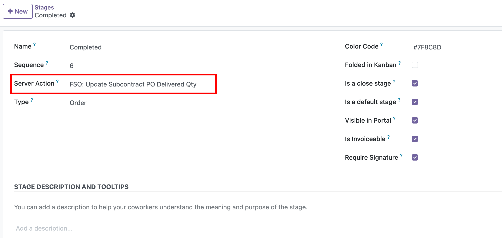

## Worker setup

1. Go to Field Service > Master Data > Workers.
2. Open the worker that represents the external vendor.
3. Make sure the related partner is configured as a vendor.
4. Enable Is Subcontractor on the worker.

## Template setup

1. Go to Field Service > Master Data > Templates.
2. Open the template that can create subcontract Purchase Orders.
3. Set the Subcontracting Service Product.
4. Use a service product that can be purchased.
5. If vendor bills are controlled by received quantities, update the delivered
   quantity before creating the vendor bill.

## Stage automation

1. Go to Field Service > Configuration > Stages.
2. Open the stage that should create the draft Purchase Order.
3. Assign the server action FSO: Create Subcontract PO.

1. Open the closing stage that should update delivered quantities.
2. Assign the server action FSO: Update Subcontract PO Delivered Qty.
3. This action copies timesheet hours to the Purchase Order delivered quantity.

