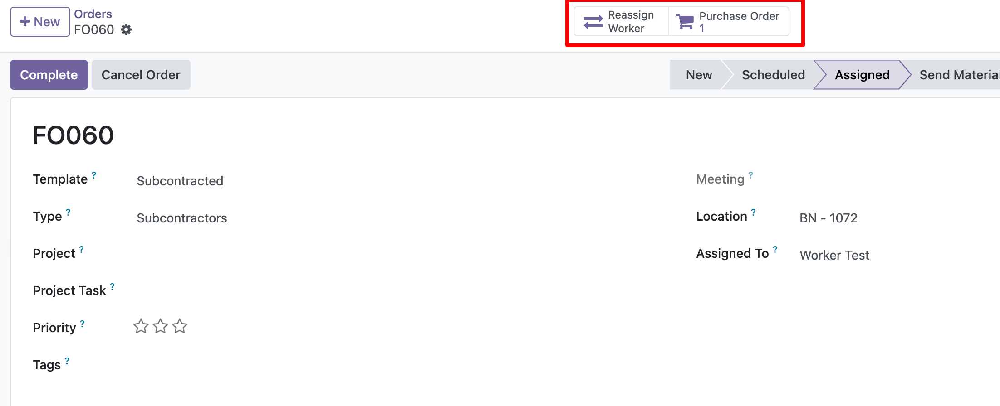
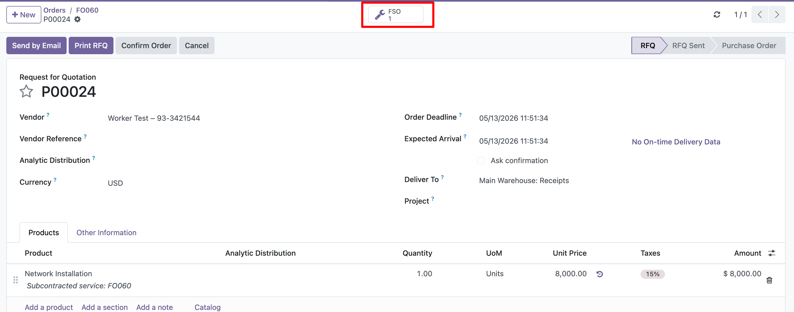

## Create the subcontract Purchase Order

1. Create or open a Field Service Order that uses a template configured for
   subcontracting.
2. Assign a subcontractor worker.
3. Move the order to the stage configured to create the subcontract Purchase
   Order.

1. Use the Purchase Order smart button to open the generated draft Purchase
   Order.
2. Review the Purchase Order.
3. Confirm the Purchase Order manually.

1. If the Purchase Order is not created, check the Field Service Order chatter.
2. Review the reason posted by the module.
3. Fix the missing configuration or worker data.
4. Move the order through the configured stage again if needed.

## Update delivered quantities

1. Log timesheet hours on the Field Service Order.
2. Move the Field Service Order to the stage configured to update subcontract
   delivered quantities.
3. The module updates the subcontract Purchase Order line quantity with the total
   timesheet hours of the Field Service Order.
4. The module also updates the received quantity on the Purchase Order line.
5. Create the vendor bill after the delivered quantity has been updated when the
   product bills based on received quantities.

## Reassign or cancel an order

1. Use the Reassign Worker button when an order with at least one subcontract
   Purchase Order must be reassigned.
2. The Reassign Worker button remains available even if all linked subcontract
   Purchase Orders are cancelled.
3. The Reassign Worker button is only available while the Field Service Order is
   not in a closed stage.
4. If the Field Service Order is already in a closed stage, move it to a
   non-closed stage before reassigning the worker, if the business process
   allows it.
5. Select the new worker in the reassignment wizard.
6. Confirm the wizard.
7. The wizard cancels active subcontract Purchase Orders.
8. If the new worker is also a subcontractor, the module creates a new Purchase
   Order for that subcontractor.
9. To cancel a Field Service Order with active subcontract Purchase Orders, use
   the standard cancel action.
10. Choose whether to cancel only the Field Service Order or also its active
   subcontract Purchase Orders.
11. If there are posted vendor bills, manage the Purchase Orders and vendor
    bills manually before reassigning or cancelling the Field Service Order.
